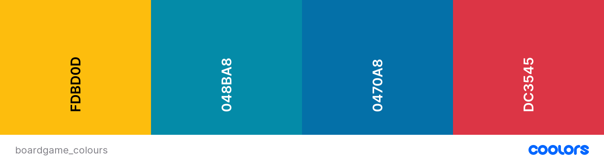

# The Hexagon 

## Code Institute Milestone Project 4

This website is created for educational purposes only.
   
The brief for this fourth Milestone project was to build a full-stack site based around business logic used to control a centrally-owned dataset. Required to be incuded are: seting up an authentication mechanism and providing paid access to the site's data and/or other activities based on the dataset, such as the purchase of a product/service. It is the fourth and final project as part of the Full Stack Web Development Program at The Code Institute. 

[Click here to view the project live via heroku](https://the-hexagon.herokuapp.com/)

## Table of Contents
1. [**Project overview**](#project-overview)
2. [**UX - User Experience**](#ux---user-experience)
3. [**User Stories**](#user-stories)
4. [**Design**](#design)
5. [**Features**](#features)
6. [**Technology**](#technology)
7. [**Testing**](#testing)
8. [**Deployment and Cloning Repo**](#deployment-and-cloning-repo)
9. [**Credits**](#credits)


## Project Overview
This website was created first and foremost as a way to fulfill the requirements of the CI project brief. The fictional company 'The Hexagon' is a boardgame café where people come to play boardgames from the café's extensive collection, paying a small fee to rent a table. Beyond the cafe, the company also has an online shop where they sell boardgames. The company operates a membership scheme, and membership can be bought online. Members play for free at the café at certain times, and get a disount on any games they buy in the onine shop. There are also events at the café, that people can sign up for online.

The Hexagon was built using [Python](https://www.python.org/) and [Django](https://www.djangoproject.com/), which is a high-level Python Web framework.

[Click here to view the project live.](https://the-hexagon.herokuapp.com/)

## UX - User Experience

### Goals
The Hexagon operates both physically (café) and online (shop). The main goal of the business owners is to encourage crossover of the two sections of the business. They hope to achieve this with the membership scheme, which gives benefits to both types of customer.

## User Stories

 | User Story ID | As a / an | I want to be able to... | So that I can... | 
 | --- | --- | --- | --- |
 | Viewing and Navigation   | 
 | 1 | User | See what I can do on this website | Get an immediate understanding of what services are offered here. | 
 | 2 | User | Navigate around the site easily and not get 'stuck' on  pages | Avoid using the browser 'back' button or having to scroll all the way up to the top of the page. | 
 | 3 | Logged in User | Be reminded that I'm logged in, and be able to easily log out | Not remain logged in on shared devices. | 
 | 4 | Shopper | View the games and their prices for sale | Browse the shop | 
 | 5 | Shopper | Easily view further details of products I'm interested in | Identify its features. | 
 | 6 | Shopper | See suggested games | Be guided to good-quality / popular products. | 
 | 7 | Member | See discount price vs normal price | Know how much I am saving. | 
 | Sorting and Searching |  |  |  | 
 | 8 | Shopper | Sort by price, rating and complexity | Easily browse the products I'm interested in. | 
 | 9 | Shopper | Filter by specific category or mechanic (and sort these) | Easily browse the products I'm interested in. | 
 | 10 | Shopper | Search by name | So I can quickly find a specific game I'd like to buy. | 
 | 11 | Shopper | Quickly view my results | Don't need to wait for the page to load. | 
 | Registration and User Accounts |  |  |  | 
 | 12 | User | Register an account | Have a profile and access the features available to registered users. | 
 | 13 | User | Receive email confirmation of registration | Be sure that I have registered properly. | 
 | 14 | Registered User | Log in and out | Access my profile, and ensure no one else uses my profile. | 
 | 15 | Registered User | Recover my password | Still access my profile if I've forgotten password. | 
 | 16 | Registered User | View my user profile | View order history and other personal details. | 
 | 17 | Registered User | Save my address details | Only fill them in once. | 
 | 18 | Registered User | Update my address details | Keep the same account when I move house. | 
 | 19 | Registered User | View my order history | Keep track of my purchases. | 
 | 20 | Registered User | See events that I'm signed up for | So that I don't have to search through my emails to check the stating time etc. | 
 | 21 | Member | See my membership details on my profile page | Know when it expires. | 
 | Purchasing and Checkout |  |  |  | 
 | 22 | Shopper | See in the nav bar that my purchase has been added to bag | Be sure my 'click' was registered. | 
 | 23 | Shopper | Click on my bag to see what's been added | Review my purchase before checkout | 
 | 24 | Shopper | Remove or update quantity in bag | Purchase muliples or rectify accidental clicks. | 
 | 25 | Logged in user | Have my adress pre-populated | Make hassle-free purchases. | 
 | 26 | Member | Have my discount autimatically applied at checkout | Take full advantage of my membership. | 
 | 27 | Shopper | Recieve feedback of successfull payment | Know that my payment went through and my order is being processed. | 
 | Membership |  |  |  | 
 | 28 | User | Easily view and compare the different options and their costs. | Decide if membership is worth it for me | 
 | 29 | Member | See my membership details | Know when it expires and what level I have. | 
 | 30 | Member | Buy new membership | Easily choose to access more benefits. | 
 | Events |  |  |  | 
 | 31 | User/Member | See what events are coming up | Decide if I'm interested in attending any events. | 
 | 32 | User/Member | Sign up for events I'm interested in | Reserve my place. | 
 | 33 | User/Member | Cancel my sign up. | Cancel my sign up. | 
 | Admin and Shop Management |  |  |  | 
 | 34 | Admin | Add/Delete games, categories and mechanics | Add/Delete games stock. | 
 | 35 | Admin | Edit games, categories and mechanics | Correct mistakes, and prices. | 
 | 36 | Admin | Add/Edit/Delete events | Create/Edit events so they can be displayed on the events page. | 
 

### Site owner goals:

| User Story ID | As a / an | I want to be able to... | So that I can... | 
| --- | --- | --- | --- |
| Site Owner Goals |  |  |  | 
| 37 | Owner | Extend discounts and offers to existing café customers | Increase sales in the shop. | 
| 38 | Owner | Make it more attractive to come to the café | Increase customer numbers in the café. | 
| 39 | Owner | Invite/inform existing customers of events | Get maximum attendence at events. |
| 40 | Owner | Have my staff members able to Add/Edit/Delete games and events | Delegate tasks. | 


## Design

The Hexagon is named so because many games use hexagon shaped tiles as part of their game, such as Settlers of Catan. The hexagon shape also makes an attractive, easy to recognise logo/icon for the company. 

The website is dynamic, and the content shown depends on who is viewing the wesite. For instance, Anonymous Users that are not signed in on their account, cannot buy membership or sign up to events, as these two things need to be tied to a user account. Another example is that is only available to users who have bought membership and are signed in is a discount on games bought. 
There is also a staff only area, where staff members can perform CRUD operations such as adding, editing and deleting products and events.

[Bootstrap](https://getbootstrap.com/) was used throughout the site in order to maintain a consistent and clean-looking site across all pages and for easy responsive functionality.

In the shop section, there are a lot of games, so the priority was to make all this data easily visible and accesible. Pagination, sorting and filtering are availablej for all users browsing the shop. The information about each game in the list of games is kept to a minimum, with further details being displayed if the user clicks on the game.

#### Wireframes

Throughout the course I have used Figma and Balsamiq, but my personal preference, when working 100% solo, is pen and paper, and that is what I used this time for the designs of the website pages. 
I played around with Figma when trying to use the 4-colour scheme as described above in the Colour Pallete section in the navbar. However, I did not use these designs and therefore have not included them here.

* [Home](/documents/wireframes/home.jpg) 
* [shop](/documents/wireframes/shop.jpg) 
* [product-detail](/documents/wireframes/product-detail.jpg) 
* [membership](/documents/wireframes/membership.jpg) 
* [static](/documents/wireframes/static-pages.jpg) 


#### Colour Palette

My initial idea was to have a dark background with the 4 bright colours often found in the boardgame pieces for basic 4-player games that many people are familiar with: red, blue, green and yellow. However, I couldn't really see how these 4 bright colours could work together without it looking crazy. I therefore chose just 2 main colours in slightly darkened shades as highlight colours. After feedback from my mentor and friends who viewed the site, I restyled the site to have a light background instead, which makes it more visually appealing.

I used the [coolors](https://coolors.co) website to help me choose complementary colours and choose the below scheme . 

 #FDBD0D (which is similar to the `-warning` colour from Bootstrap) for header, footer and some highlighted text. The Bootstrap warning classes were used in the html, but over-written in the colours.css file.
 #048BA8 for various buttons and links, with a #0470A8 on hover.
 #dc3545 for some text and buttons in the staff area, to make it clear that this was not the public website.
 Bootstraps text-light, and text-dark classes were also used.



#### Typography

I used [Google fonts](https://fonts.google.com/) to embed fonts into my site by copying the code into the <head> of my html. 
The priority was that the font is easy to read, because especially on the shop page, there are lots of little bits of text. I wanted something that was not the default, however, and found two complementary fonts: 'Nunito Sans' and 'Poppins'. The latter is only used for the nav bar and the page headers, which are lowercase by design.

#### Imagery

The shop page is very busy with images from the products on display. I found that the simple layout of shop page dictated that the other pages also should have a simple layout and style. 
For the homepage is styled with some imagery, however, with the aim of making the website and café look friendly, cosy and fun.

#### Data and Database 

### Data

##### Games
I found a database set on [Kaggle](https://www.kaggle.com/) that inculded 4999 boardgames that had been created by scraping data from the website [BoardGameGeek](https://boardgamegeek.com/), which is THE go-to website for all things boardgame. This therefore included all the attributes about a game that I wanted to include on my game description page.
*Note: There are far fewer games in the deployed version of the website due to the limits on the free version of Heroku's allocated storage capacity.*
The data came in a single .csv file, which I converted to json using an online converter. It was a single database however, with 20 key value pairs per item, as shown in the code block below.

```
[
  {
    "rank": 1,
    "bgg_url": "https://boardgamegeek.com/boardgame/174430/gloomhaven",
    "game_id": 174430,
    "names": "Gloomhaven",
    "min_players": 1,
    "max_players": 4,
    "avg_time": 120,
    "min_time": 60,
    "max_time": 120,
    "year": 2017,
    "avg_rating": 8.98893,
    "geek_rating": 8.61858,
    "num_votes": 15376,
    "image_url": "https://cf.geekdo-images.com/original/img/lDN358RgcYvQfYYN6Oy2TXpifyM=/0x0/pic2437871.jpg",
    "age": 12,
    "mechanic": "Action / Movement Programming, Co-operative Play, Grid Movement, Hand Management, Modular Board, Role Playing, Simultaneous Action Selection, Storytelling, Variable Player Powers",
    "owned": 25928,
    "category": "Adventure, Exploration, Fantasy, Fighting, Miniatures",
    "designer": "Isaac Childres",
    "weight": 3.7543
  },
```
I wrote a file called `data_convert.py` to reorder the data into the appropriate format in order for it to be used in the Django database. This file is included in the project directory. When all the data was in the correct format it was saved in a fixtures folder and uploaded to the Django database via the `manage.py loaddata <fixturename>` command.

```
[
  {
    "model": "myapp.person",
    "pk": 1,
    "fields": {
      "first_name": "John",
      "last_name": "Lennon"
    }
  },
  {
    "model": "myapp.person",
    "pk": 2,
    "fields": {
      "first_name": "Paul",
      "last_name": "McCartney"
    }
  }
]

```

There was a lot of string manipulation involved, and I needed to add some extra fields. As an example, the data set did not come with prices, so these were inserted as values by using Python's `randint()` function.
I also seperated out the “category” and "mechanic" attributes of the games into separate tables in order to create a relational database structure. I separated these into new dictionaries with a few extra items, and put these in a new json file. I also replaced the old “category” and "mechanic" entries in the original file with the new primary keys that they related to in a new dict item (“item_ids”). 


##### Other Data
All other data was created as a function of creating models and by user input.

### Database and Models

Django uses the standard **sqlite3** database that comes with installation of the developent framework and this was used during development. The deployed website used **PostgreSQL**, which is the SQL database provided by Heroku. 

The models were created in their relevant apps, after which they were initialised with the terminal command `python manage.py makemigrations`. After this `python manage.py migrate` was used to synchronise the database with the models and create the tables and relationships.

Apart from the 3 models relating to the products sold in the shop, I created 5 other models, making a total of 8. Django also provides the additional **User** model.

**Games app models**
Within the **games** app, the **Product** model holds the details relevant to the products in the shop. The **Category** and **Mechanic** models are foreign keys to the **Product** model. The three tables have a many to many relationship, as each game can have multiple categories and mechanics. 

**Membership model**
There are two levels of membership, so a boolean was used to differentiate these. The **Membership** model is related to the **OrderLineItem** in order to purchase it, and **UserProfile** model in order to assign the correct privileges to a user.

**Events model**
The **Events** model only has one relationship, and that is a Many to Many relationship to the **UserProfile**. 
 
**UserProfile**
The **UserProfile** model is used to store delivery information about specific users within the **User** model. Users edit this from their profile page in order to speed up the checkout process.

**User model**
The User model used is the standard one provided by `django.contrib.auth.models` and allows users to be designated with *staff status* or *Superuser status*.


A simplified diagram of the schema is visible below. 


## Features

#### Existing Features

##### Consistent Features across all pages

- Always-visible navigation bar with *The Hexagon* logo on the left (linking to the home page), and links to the sub-pages centered in the middle. Account management and shopping bag icons/links are on the right of the nav, as well as a log out button for logged in users.
- The shopping bag is always displayed with an icon, showing the number of items in there, if any.
- On small screens the navigation bar changes to a hamburger button which brings up a navigation menu when clicked.
- Sticky footer with the contact details and a link to Google Maps.
- User feedback is provided by toasts that pop up after performing an action such as adding an item to bag, checkout success, or editing an event as a staff member.

##### Home

- The home page is sectioned into four parts that describe what the purpose of the company is.
- The sections contain links to the pages they relate to, in particular to make it easier for mobile users to navigate to their desired location.
- The **café** and **membership** sections are static, but have background images to provide some colour and life.
- The **events** and **shop** sections make use of a carousel (not coded by me, attributed in credit section and code) that displays a selection of randomly chosen events and games. This was a last minute addition because the previous static homepage felt that it was not eye-catching enough. The carousels hold the attention of the user as they are curious to see what comes round next. 

##### Shop / Games

- Filter, Sort and Search options at the top on all screens.
- Amount of games per row determined by screen size.
- Pagination in order to load quicker and avoid endless scroll.
- Items per page dropdown for those with fast internet.
- Back to Top button appears after scrolling.
- Members see their discount reflected in the displayed prices.
- Detailed information is provided on the game detail page, with a link to return to the list view.

##### Membership

- The different levels of membership are laid out side by side on larger screens to easily compare them, and stack on top of each other on smaller screens to maintain readability.
- Dropdown menu to select duration of each membership.
- The content of the page changes depending on the user. If user is a member, then they see their membership level and expiry date at the top of the page. If they are an anonymous user, they see a Log in link instead of a Buy button.

##### Events

- The events are split up by month, which cycle left and right (using Django's template tag) in order to make the page look a bit more interesting. 
- Simple cards display the neccesary information.
- Some of the content changes depending on the user.
    - An anonymous user is prevented from signing up, and sees an error toast informing them that they must login first.
    - This is a similar case for a non-member trying to sign up for a member-only event.
    - Signed up users see an 'Unsign' button for events they have signed up for.

##### Account Management

- Account management is handled by Django's allauth 
- In order to unclutter the nav bar, all actions related to a user's account were consolidated into the My Profile page wher users can log in, register, and log out. 
- Emails sent to user for account management operations, for instance after registering, and to reset password.

##### My Profile

- Non-logged in users are shown Sign Up and Log In buttons.
- Can log out from here.
- Shows up to 5 sections of information depending on the user:
    - Membership level and expiration (or invitation and link to membership page if not member.)
    - Address details - which can be updated.
    - Order History
    - Any events that the user has signed up for
    - Ability to log in as staff to access the staff area app.

##### Bag

- Able to see a table of items in bag.
- Can add/remove items and update bag.
- Can see discount, if applicable.
- Link to return to shop page.

##### Checkout

- Can checkout as guest OR as a registered user. The latter option allows for saving user's address.
- Link to return to bag, and to complete order.
- Stripe payments fully implemented
    - Loading screen while card details are being checked.

##### Staff Area

- Account management is handled by Django's own allauth app.
- In order to unclutter the nav bar, all actions related to a user's account were consolidated into the My Profile page where users can log in, register, and log out. 


#### Future Features
With time and resources allowing, other goals are to implement:
- Emails to be sent to users after successfull checkout and event register. I realised that not having these types of email implemented is not great UX. This feature was accidentally left off my to do list and I just did not have time to implement it by the time I realised.
- Add a 'Featured product' boolean to the Product model in order to promote certain games or categories.
- Add option to filter for 2-player games so that users can quickly browse games designed specifically for duos. This would make a good category to promote for Valentine's day for example.
- Add marker for active page in navbar
- Show how many products found in filter/sort
- Next/last buttons on pagination
- Calendar view on event page
- Add 'is recurring weekly/fortnighly/monthly' functionality for creating events
- Auto-delete past events
- Ability for users to book a table


#### Defensive Programming

I made sure to wrap all necessary database queries in ```try``` except blocks in order to catch relevant exceptions. These were usually of the type 'ValueError' or 'TableName.DoesNotExist'. I preferred using these in place of get_object_or_404 where possible, to ensure that the site remained functional even when errors occurred.

## Technology

#### Languages Used
- HTML5
- CSS3
- jQuery
- Python

#### Frameworks, Libraries & Programs Used

1. [Django](https://www.djangoproject.com/) - Django is a high-level Python Web framework that encourages rapid development and clean, pragmatic design.
2. [JQuery](https://jquery.com) to simplify DOM manipulation.
3. [Gitpod](https://www.gitpod.io/) - Gitpod was the environment in which the site was created, using the terminal to commit to Git and Push to GitHub.
4. [Github](https://github.com/) - Hosting for software development and version control using Git.
5. [Bootstrap](https://www.bootstrapcdn.com/) to simplify the structure of the website and make the website responsive easily.
6. [Google Fonts:](https://fonts.google.com/) - Google fonts were used to import the 'Nunito Sans' and 'Poppins' fonts.
7. [Font Awesome:](https://fontawesome.com/) - Font Awesome was used on all pages throughout the website to add icons for aesthetic and UX purposes.
8. [Stripe](https://stripe.com) as payment platform to validate and accept credit card payments securely.
9. [PIP](https://pip.pypa.io/en/stable/installing/) for installation of various tools needed in this project.
10. [Heroku](https://www.heroku.com/home) - Heroku is a cloud platform where the site is deployed.
11. [Django Heroku](https://pypi.org/project/django-heroku/) to improve deployment of Django projects on Heroku.
12. [Django Crispy Forms](https://django-crispy-forms.readthedocs.io/en/latest/) to style Django forms.
13. [SQlite3](https://www.sqlite.org/index.html) for the development database, provided by Django.
14. [PostgreSQL](https://www.postgresql.org/) for the deployed production database, provided by Heroku.
15. [Gunicorn](https://pypi.org/project/gunicorn/) WSGI HTTP Server that to aids in deployment of the Django project to Heroku.
16. [AWS S3 Bucket](https://aws.amazon.com/) to host the static files of the site.
17. [Boto3](https://boto3.amazonaws.com/v1/documentation/api/latest/index.html) to enable creation, configuration and management of AWS S3.
18. [Django Storages](https://django-storages.readthedocs.io/en/latest/) a collection of custom storage backends with django to work with boto3 and AWS S3.
19. [Psycopg2](https://pypi.org/project/psycopg2/) as PostgreSQL database adapter for Python.


## Testing

See separate [Testing](https://github.com/BonnieMcb/boardgame/blob/master/testing.md) file


## Deployment and Cloning Repo

### Deployment to Heroku

1. Log into Heroku and on the dashboard go to NEW > Create New App. 
2. Name the project and select the closest region.
3. Choose Github as the deployment method, and connect the relevant Github repo.
4. Next, go to Settings > Config Vars > Reveal Config Vars and set up the variables for all secret keys. 
5. Before deploying to Heroku, some files need to be set up within the Gitpod IDE.
6. The requirements.txt file, and the Procfile can be created within the terminal by typing `<pip3 freeze > requirements.txt>` and `<echo web: python app.py > Procfile>`, respectively, making sure to delete any blank lines that sometimes get created. 
7. Gunicorn must be in the Procfile.
8. Set up the Heroku Postgress add-on in the resources tab.
9. Use pip3 to install `dj_database_url` and `psycopg2-binary`
10. Import and set up the dj_database_url in settings.py in Github, and add the Heroku postgress config var.
11. `migrate` and `loaddata` databases to Heroku
12. Commit and push to the Github repo, and to Heroku.
13. Log into Heroku and on the dashboard go to NEW > Create New App. 
14. Name the project and select the closest region.
14. Choose Github as the deployment method, and connect the relevant Github repo.
16. Next, go to Settings > Config Vars > Reveal Config Vars and set up the variables for all secret keys. 
17. In the Deploy tab, turn on Automatic Deployment, and then click Deploy Branch to deploy the master and allow Heroku to build the app. Once complete, clicking View App will open it.

### Cloning this repo

1. At the top of this repository, click Clone or download.
2. In the Clone with HTTPs dropdown, copy the clone URL for the repository.
3. In your IDE terminal, change the current working directory to the location where you want to clone the repo.
4. Type `<git clone>`, paste the URL you copied in Step 2, and then press Enter.
5. In the terminal type `<pip3 install -r requirements.txt>` in order to install all required modules.
6. Set up an env.py file in the root directory, and set the variables for IP, PORT, SECRET_KEY, MONGU_URI and MONGODB_NAME as described above.
7. The web application can now be run by typing `<python3 app.py>` in the terminal.


## Credits

#### Code

Stack overflow was invaluable once again. Any code directly copied from there has been attributed with comments in code.
Some code, in particular the JavaScript, was copied from the Code Institute video lessons, and has been attributed within comments in the code.

**Carousel**
With help from https://azmind.com/bootstrap-carousel-multiple-items/

**Back to Top Button**
https://mdbootstrap.com/snippets/jquery/bartek-malanowski/23

**Pagination**
help from: https://samulinatri.com/blog/django-pagination-tutorial/

**To create the sorting URLs**
    # With help from: https://stackoverflow.com/questions/11280948/best-way-to-get-query-string-from-a-url-in-python
    # and https://stackoverflow.com/questions/4591525/is-it-possible-to-pass-query-parameters-via-djangos-url-template-tag

**Random function for carousels**
# safe random function with help from:
    # https://books.agiliq.com/projects/django-orm-cookbook/en/latest/random.html

#### Content

All code was written by the developer.

#### Media

cafe photo in cafe section of home page - https://line.17qq.com/articles/gsmgkmpsy.html
4 colour game in shop section of home page - Photo by Folu Eludire on Unsplash


#### Acknowledgements

My Mentor Can Sücüllü for insightful and thoughtful feedback and testing guidance.

My partner Ben for invaluable feedback and endless cups of tea.


